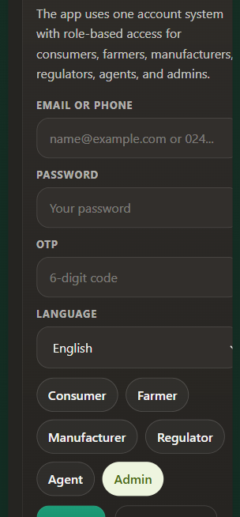

# FoodTrace GH

FoodTrace GH is a Ghana-focused food and drug traceability platform for consumers, farmers, manufacturers, pharmacists, and regulators.

It is designed to help people:
- scan product safety quickly
- log farm inputs and monitor withdrawal periods
- create batch records and QR codes
- manage drug and food recalls
- review consumer reports and compliance issues
- support feature-phone access through USSD and SMS fallback

## Tech Stack

- Backend: Node.js, Express, PostgreSQL, Redis
- Web: React, Vite
- Mobile: React Native, Expo
- Messaging: Africa's Talking
- Audio: Google Text-to-Speech with Expo Speech fallback
- Storage: PostgreSQL + local uploads

## What is in the build

- Authentication and roles
- Consumer QR scan and report submission
- Farmer portal
- Manufacturer portal
- Drug / pharmacy module
- Regulator dashboard
- Mobile consumer app
- Web portals
- USSD and SMS fallback
- Audio safety summaries
- Docker and CI/CD prep

## Module Overview

1. **Auth and roles** - sign in, register, OTP, JWT, and role-based access for all user types.
2. **Consumer scanner** - QR lookup for food and drug products with safe, caution, and recalled results.
3. **Farmer portal** - farm registration, crop cycles, input logging, withdrawal tracking, and offline sync.
4. **Manufacturer portal** - batch creation, QR generation, recall handling, and compliance records.
5. **Drug / pharmacy module** - pharmacy registration, drug records, batch logging, QR generation, and recalls.
6. **Regulator dashboard** - compliance overview, alerts, report review, analytics, and emergency recall actions.
7. **Mobile app** - consumer-friendly mobile screens with local scan history and audio summaries.
8. **Web portals** - role-protected farmer, manufacturer, regulator, and consumer web views.
9. **USSD and SMS** - feature-phone access for safety checks and pesticide logging without a smartphone.

## Screenshot



## Repository Layout

```text
foodtrace-gh/
  backend/
  mobile/
  web/
  shared/
  scripts/
  docs/
```

## Local Development

1. Clone the repository.
2. Install dependencies:
   ```bash
   npm install --legacy-peer-deps
   ```
3. Copy the environment file:
   ```bash
   copy .env.example .env
   ```
4. Update `.env` with your local database, Redis, and API credentials.
5. Run database migrations:
   ```bash
   npm run db:migrate
   ```
6. Seed development data:
   ```bash
   npm run db:seed
   ```
7. Start the backend:
   ```bash
   npm run dev:backend
   ```
8. Start the web portal:
   ```bash
   npm run dev:web
   ```
9. Start the mobile app:
   ```bash
   npm run dev:mobile
   ```

## Docker

You can run the backend with PostgreSQL and Redis using Docker:

```bash
docker compose up --build
```

The backend container listens on port `3000`.

## Environment

See [`.env.example`](./.env.example) for the full list of environment variables, including:
- PostgreSQL connection
- Redis connection
- JWT secret
- AWS S3 settings
- Google Text-to-Speech
- Africa's Talking
- frontend and mobile origins

## API Base URL

Default local API base:

```text
http://localhost:3000/api
```

## Postman Collection

Import the collection at:

```text
docs/FoodTrace.postman_collection.json
```

It includes example requests for:
- auth
- farmer workflows
- manufacturer workflows
- consumer scan and reports
- pharmacy workflows
- regulator workflows
- USSD and SMS endpoints

## Project Docs

- [Master Spec](./MASTER_SPEC.md)
- [Architecture](./ARCHITECTURE.md)
- [Data Model](./DATA_MODEL.md)
- [API Contract](./API_CONTRACT.md)
- [Contributing](./CONTRIBUTING.md)

## Acknowledgement

CodeQuest 2026, Group 94, KNUST

## License

Released under the MIT License. See [LICENSE](./LICENSE).
